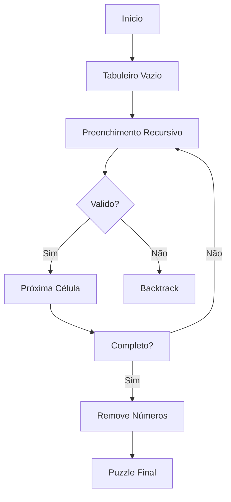
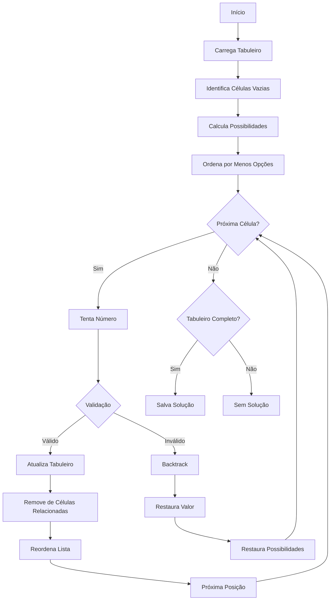

# Sudoku generator and solver with visual feedback using Python
📝 Descrição

✨ Este projeto implementa um gerador e solucionador de Sudoku 9x9 completo com feedback visual, com capacidade para:

    Gerar tabuleiros 9x9 de Sudoku válidos

    Resolver tabuleiros 9x9 criados

    Visualizar o processo em tempo real usando 'matplotlib'

O algoritmo usado em ambos os casos é o 'backtracking' e, sendo assim, às vezes o programa pode demorar um pouco mais para criar/resolver o Sudoku.

📝 Output

O programa gera:

    complete_table.csv - Tabela completa com os números esperados
    table.csv - Tabela com os espaços vazios
    solution.csv - Tabela com a solução encontrada pelo 'sudoku_solver.py'
### ⚙️ Fluxo de Geração

### 🧩 Fluxo de Solução

